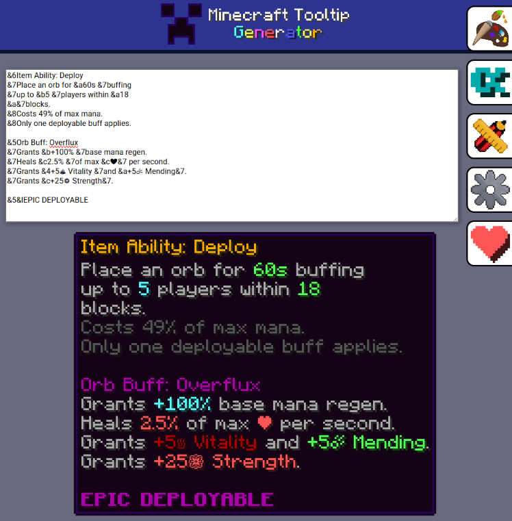
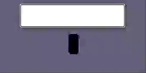
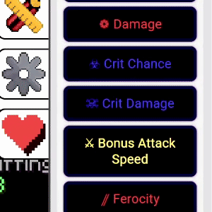
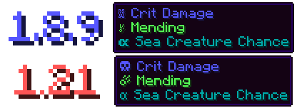

# Minecraft Tooltip Generator


**Hello**, **greetings** or **Good Morning**!

Creating items for Hypixel Skyblock Concepts (or Minecraft Tooltips) can be a little bit of a struggle. And there aren't many web based options for generating Minecraft Tooltips... **Until now!**

This website allows you simply type in the text for an item, and it will automatically render a Minecraft style tooltip out for you, ready for copying straight into your concepts or project.



## Features
- Realtime Rendering\

    - This can be toggled to lower refresh rates for weaker devices or battery conservation purposes.
- Handy Guides for Most of the Icons and color codes that you would ever need\

- Supports both 1.8.9 **and** 1.21 fonts\
<sup>(Hopefully you can tell the difference between the two)</sup>\

- 99%+ Similarity to Original Minecraft Rendering\
<sup>(Subject to the Terms and Conditions of your Personal Standards)</sup>


## Example
```
&5Overflux Capacitor
&6Item Ability: Deploy
&7Place an orb for &a60s &7buffing
&7up to &b5 &7players within &a18
&a&7blocks.
&8Costs 49% of max mana.
&8Only one deployable buff applies.

&5Orb Buff: Overflux
&7Grants &b+100% &7base mana regen.
&7Heals &c2.5% &7of max &c❤&7 per second.
&7Grants &4+5♨ Vitality &7and &a+5☄ Mending&7.
&7Grants &c+25❁ Strength&7.

&5&lEPIC DEPLOYABLE
```
**Will be converted into...**\


## Future For the Project
I haven't really thought of where this might end up. Mainly just using it as an excuse to make a project for my coding portfolio. I have a couple more extra features that I would love to incorporate, but getting to this point has been a bit of a struggle.

Feel free to leave an "Issue" on the GitHub page with any ideas for improvements or bug fixes. I'll eventually take a look at it and make changes.

## After Thoughts
Normally something important would go here.\
But I have nothing. 

Good luck with whatever you end up making with this!\
Hopefully it inspires some change in Skyblock.